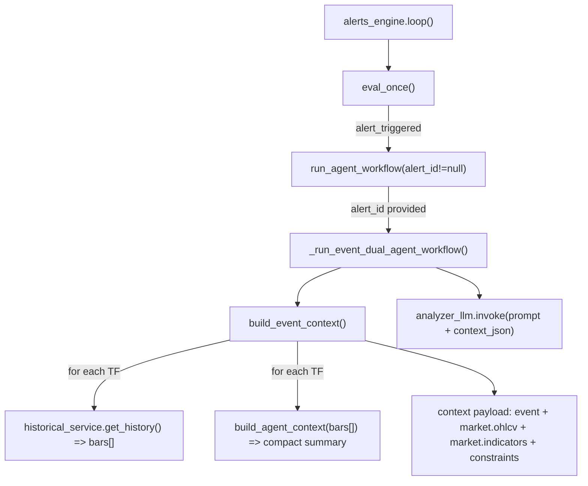

# Event Context JSON 优化与一致性增强清单（MVP）

本文聚焦两件事：
1) 对当前 `build_event_context` 产出的 JSON 做“可压缩、可解释、可控格式”的优化清单（按优先级排序）。  
2) 为后续“上下文工程（跨事件一致性）”做输入/输出约束的设计草案。

---

## 0. 现状概览（当前 JSON 结构）

当前事件上下文（event context）主要包含：
- `event`: event_id / trigger_type / trigger_text / symbol / timeframe / snapshot_time（Unix 秒）
- `market.ohlcv`: 多时间框架的 OHLCV 数组（目前为 H1、M15，长度分别默认 400/600）
- `market.indicators`: 每个时间框架的指标与结构信息（含 `basic_indicators` / `advanced_indicators` / `raja_sr_zones` / `msb_zigzag`）
- `constraints.output_schema`: 输出字段约束（目前较宽松）

目标：在不损失“决策必要信息”的前提下减少噪声、降低 token 成本、提升 AI 在相似条件下输出的一致性与可审计性。

---

## 1) P0：体积压缩（先把 token 花在刀刃上）

### 1.1 压缩 OHLCV（最大体积来源）

问题：
- `market.ohlcv.H1` 与 `market.ohlcv.M15` 是 JSON 体积的大头，且对 LLM 来说大量为“重复/噪声信息”。

建议（优先级从高到低）：
- 仅保留事件 TF（如 M15）的“事件窗口”K 线：
  - 例如：`snapshot_time` 前后 N 根，或最近 N 根（如 200~300）
- 高周期 TF（如 H1）只保留更短窗口（如 50~200），或完全删除原始 bars，仅保留其摘要指标与结构结论。
- 删除/裁剪低价值字段：
  - 若 `delta_volume` 恒为 0，可移除
  - `source` 若高度重复，可移除或提升为顶层元信息（例如 `data_source: "poll"`）

### 1.2 去重：recent_bars vs ohlcv

问题：
- `market.indicators.*.recent_bars` 与 `market.ohlcv.*` 尾部 bars 存在重复（同一根 K 的 OHLCV 被存了两遍）。

建议：
- 删除 `recent_bars` 或将其改为引用索引：
  - `recent_bar_times: [t1, t2, t3]` 或 `recent_bar_idx: [-3, -2, -1]`

---

## 2) P0：语义时间语境（提升理解，减少“算术”）

问题：
- LLM 难以对 Unix 时间戳执行即时算术推理（例如 `1777046400`），也难以自然关联“时段→流动性/波动性预期”。

建议：
- **保留 Unix 时间戳用于系统路由，但附加人类可读时间**
  - `snapshot_time_unix: 1777046400`
  - `snapshot_time_iso: "2025-10-23T14:30:00Z"`
- **加入会话标签（session tagging）**
  - `market_session: "London-NY Overlap" | "London_AM" | "NY_PM" | ...`
  - 可选：`is_market_open: true/false`
- **相对索引（relative indexing）**
  - 对关键事件使用相对索引，避免模型做时间戳映射：
    - `bars_ago: 0/1/2`
    - 对最近的 MSB/ChoCh/BoS：`event_bars_ago`

---

## 3) P0：价格行为邻近性过滤（SR/MSB 不要“全塞”）

问题：
- `raja_sr_zones` 数组内容全面，但包含距离当前价格很远的区域；模型需要自行筛选/做减法，噪声大且容易选错。

建议：
- **按邻近度筛选 + 排序**
  - 仅提供当前价格上方 2~3 个“最相关阻力”，下方 2~3 个“最相关支撑”
  - 其余 zones 可留在系统侧（或另一个 debug 通道），不进入 LLM 上下文
- **显式距离字段（避免模型做减法）**
  - 在 SR 与 MSB 对象中添加：
    - `distance_to_price_pips`（或 points）
    - `distance_pct`（百分比距离）
  - 这样能直接突出“关键流动性池的接近程度”

---

## 4) P1：多时间框架联动摘要（减少模型自行“主次判断”）

现状：
- H1 与 M15 分别提供 Market_Structure（如 H1=`HH_HL`，M15=`Consolidation`），但缺少两者联动总结。

问题：
- 多周期冲突时，AI 需要自行决定主次关系，容易误判；也会加剧“前后不一致”。

建议：
- 增加顶层字段 `multi_tf_alignment`（由系统侧预处理生成）：

```json
"multi_tf_alignment": {
  "direction": "bullish",
  "consistency": "moderate",
  "note": "H1 uptrend, M15 consolidation near resistance – wait for breakout or reversal signal"
}
```

---

## 5) P1：指标定义/量纲显式化（避免风险评估误用）

现状：
- 例如 `ATR_14=20.41`、`MACD.hist=6.235` 等没有单位说明。

问题：
- AI 可能误解量纲，导致止损/仓位推导错误（例如误用 ATR 计算 SL）。

建议：
- 在根层级加入 `indicator_notes`（或为每个指标附加 `unit/description`）：

```json
"indicator_notes": {
  "ATR_14": "基于最近14根K线的真实波幅均值，单位为价格点",
  "MACD": "标准参数(12,26,9)，histogram 单位为价格点",
  "RSI_14": "相对强弱指数，0-100"
}
```

---

## 6) P1：输出 Schema 优化（可解释性 + 可用性 + 一致性）

现状：
- `constraints.output_schema` 只要求 `signal/strength/entry/sl/tp`，且语义模糊、格式不够严格。

主要问题：
- `entry` 用数组但未说明是否分批入场；单一入场用数组容易误解。
- `strength=1-10` 含义模糊（趋势强度？信号置信度？）。
- 缺乏 `reasoning` 与失效条件，后续复核困难。

建议（MVP 目标 Schema）：

```json
"output_schema": {
  "signal": "buy | sell | hold",
  "confidence": "1-10",
  "entry_price": 4725.00,
  "stop_loss": 4710.00,
  "take_profit": [4735.00, 4745.00],
  "reasoning": "3-5句核心逻辑，包含多周期共振、结构、指标、量价",
  "risk_metrics": {
    "risk_amount_pips": 15.0,
    "reward_ratio": 2.0
  },
  "invalidation_condition": "什么情况下该信号失效",
  "trade_horizon": "scalp | intraday | swing"
}
```

精度控制建议：
- 价格保留 3 位小数
- 指标值保留 2~4 位小数

---

## 7) P1：加强产出约束（让结果可控、可回测、可接执行面板）

核心原则：
- 目标输出模式决定 agent 如何与执行工具/面板通信，必须可解析、可校验、可稳定复现。

建议：
- 输出强制 `strict_json`（禁止夹杂自然语言）
- 必须包含字段（建议最小集合）：
  - `signal`, `confidence`, `reasoning`, `entry_price`, `stop_loss`, `take_profit`
  - `risk_reward_ratio`, `invalidation_condition`, `trade_horizon`
- 推理字段：
  - 强制 `reasoning` 为字符串（简短逻辑），便于后续诊断与优化
- 交易管理指标：
  - `risk_metrics`（risk_pips、RR、可选 slippage 等）

---

## 8) P2：冗余字段的进一步收敛（细节优化）

可考虑的裁剪项：
- `delta_volume` 恒为 0 时移除
- `source` 高重复时移除或提升为顶层元信息
- RajaSR zone 内 `level` 与 `bottom` 重复时移除其一
- 浮点精度统一（避免无意义长小数干扰注意力）

---

## 9) 面向“前后策略一致性”的上下文工程（脑暴方向）

问题描述：
- 连续触发的事件中，模型容易“各自为战”：第一条建议 buy，30 分钟后建议 hold/sell，但不说明与上一条的关系与失效依据。

建议（分层实现）：
1) **Decision State Card（状态卡）**
   - per symbol+tf 维护一张结构化状态卡：`position_state/thesis/invalidation_rules/last_decision`
2) **强制关联上一事件**
   - 输出必须包含 `decision_delta`：与上一决策相比证据变化是什么
   - 若反转，必须点名触发了哪条 `invalidation_condition`
3) **事实表 → 立场分离**
   - 先输出“事实表”（只引用 JSON），再输出“交易立场”，提高稳定性与可审计性

---

## 10) 目标 JSON 草案（汇总示例）

以下示例用于对齐方向（字段可按 MVP 逐步落地）：

```json
{
  "schema_version": "1.1.0",
  "event": {
    "trigger_type": "manual_dump",
    "symbol": "XAUUSDz",
    "snapshot_time_unix": 1777046400,
    "snapshot_time_iso": "2025-10-23T14:30:00Z",
    "market_session": "London_AM",
    "is_market_open": true,
    "spread_pts": 1.2,
    "upcoming_news_impact": "low"
  },
  "multi_tf_alignment": {
    "direction": "bullish",
    "consistency": "moderate",
    "note": "H1 uptrend, M15 consolidation near resistance – wait for breakout or reversal signal"
  },
  "indicator_notes": {
    "ATR_14": "基于最近14根K线的真实波幅均值，单位为价格点",
    "MACD": "标准参数(12,26,9)，histogram 单位为价格点",
    "RSI_14": "相对强弱指数，0-100"
  },
  "context": {
    "trend_timeframe": "H1",
    "execution_timeframe": "M15",
    "risk_params": {
      "account_balance_usd": 10000,
      "risk_per_trade_pct": 1.0,
      "max_slippage_pts": 3.0,
      "position_size_mode": "fixed_risk"
    }
  },
  "market_data": {
    "ohlcv": {
      "H1": [],
      "M15": []
    },
    "indicators": {
      "H1": {
        "current_price": 4724.62,
        "basic": { "SMA_20": 4695.54, "RSI_14": 67.68, "ATR_14": 20.42, "MACD": {} },
        "structure": {
          "trend_bias": "HH_HL",
          "recent_breaks": [],
          "active_sr_zones": []
        }
      },
      "M15": {}
    }
  },
  "constraints": {
    "output_format": "strict_json",
    "required_fields": [
      "signal",
      "confidence",
      "reasoning",
      "entry_price",
      "stop_loss",
      "take_profit",
      "risk_reward_ratio",
      "invalidation_condition",
      "trade_horizon"
    ],
    "output_schema": {
      "signal": { "type": "string", "enum": ["buy", "sell", "hold"] },
      "confidence": { "type": "integer", "minimum": 1, "maximum": 10 },
      "reasoning": { "type": "string", "description": "3-5句核心逻辑，包含多周期共振、结构、指标、量价" },
      "entry_price": { "type": "number" },
      "stop_loss": { "type": "number" },
      "take_profit": { "type": "array", "items": { "type": "number" } },
      "risk_reward_ratio": { "type": "number" },
      "invalidation_condition": { "type": "string" },
      "trade_horizon": { "type": "string", "enum": ["scalp", "intraday", "swing"] }
    }
  }
}
```

---

## 11) event_dual 调用关系（为何走 build_event_context 而非 build_agent_context）

### 11.1 流程图（Mermaid）



### 11.2 关键点解释

- `build_agent_context(bars)` 本身就是“高密度摘要”设计：只输出最近 bars 的摘要 + 指标汇总。
- 但 `build_event_context(...)` 当前的实现会：
  - 把每个 TF 的 **原始 bars 全量**写入 `market.ohlcv[tf]`
  - 同时再把 `build_agent_context(bars)` 的摘要结果拆开写入 `market.indicators[tf]`
- 因此，event_dual 目前喂给模型的 context 是“全量 OHLCV + 摘要指标”并存，而不是仅摘要。

补充：为什么 event_dual 走的是 `build_event_context`（而不是直接用 `build_agent_context` 的返回 JSON）
- `build_agent_context(bars)` 的输入只有单一 TF 的 bars，返回的也只是“该 TF 的摘要 JSON 字符串”；它不包含：
  - `event` 元信息（trigger_type/trigger_text/snapshot_time 等）
  - 多时间框架（H1 + M15）并行数据结构
  - `missing_indicators` 这类质量标记
  - `constraints` 输出约束
- event_dual 的 analyzer 被明确约束“禁止调用工具”，因此实现上倾向于一次性把上下文所需信息都打包进 prompt（哪怕有过度提供的情况），以减少运行时依赖与不确定性。
- `build_event_context` 也把“原始 bars（可复核/可扩展）”与“摘要指标（便于直接推理）”同时提供，便于后续扩展更多指标或做调试对齐（代价就是上下文更大）。
